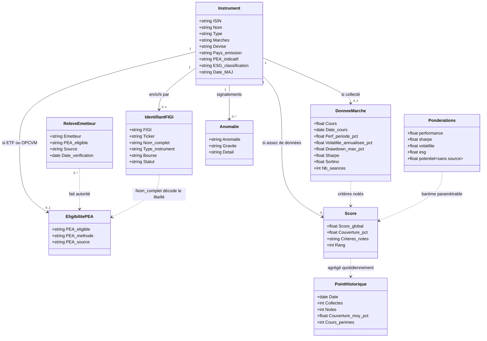
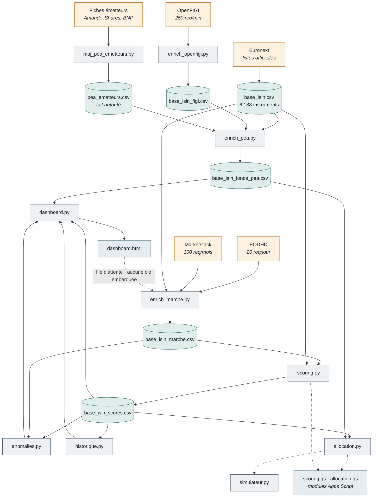
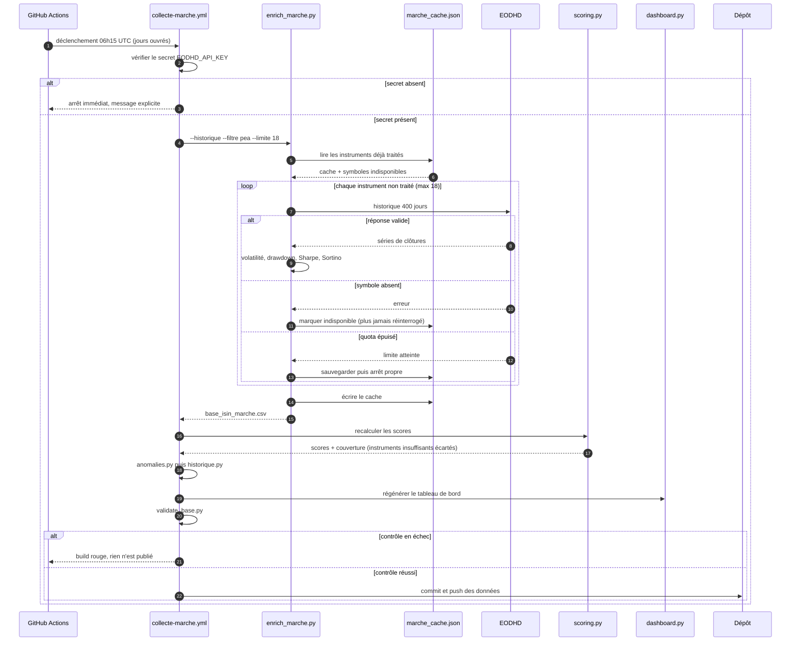

# PEAFirst

Deux briques complémentaires réunies dans un même dépôt :

- **la chaîne de données** (`scripts/`) — de la liste brute des instruments
  Euronext jusqu'aux scores, au SRI et au tableau de bord statique. Sans aucune
  dépendance, exécutée quotidiennement par GitHub Actions ;
- **l'application PEAdvisor** (`peadvisor/`) — API REST FastAPI, base SQLite,
  interface web, scoring paramétrable, allocation, simulateur, watchlist et
  serveur MCP.

Les deux se rejoignent en un point : la source **`peafirst`** de l'application
lit le référentiel produit par la chaîne. L'application dispose ainsi de
données réelles et d'une éligibilité PEA vérifiée, là où son jeu `seed` reste
illustratif.

> **[Mode d'emploi → `docs/MODE_EMPLOI.md`](docs/MODE_EMPLOI.md)**
> Installation, clés d'API, chaîne de traitement pas à pas, réglages,
> problèmes courants et limites connues.

*Aide à la décision — ni conseil en investissement, ni conseil fiscal.*

---

## En bref

| | |
|---|---|
| Univers | 6 188 instruments Euronext (actions, ETF, OPCVM) |
| Identifiants | FIGI, ticker et nom complet via OpenFIGI |
| Éligibilité PEA | relevés émetteurs + règles métier, avec traçabilité de la source |
| Indicateurs | volatilité, drawdown, Sharpe, Sortino, performance |
| Risque | SRI estimé (bornes PRIIPS), volatilité, drawdown |
| Décision | score pondéré paramétrable, TOPSIS, moteur d'allocation SRI |
| Simulation | versements programmés, horizons 2 à 10 ans, scénarios, fiscalité 2026 |
| Restitution | tableau de bord HTML autonome, API REST, interface web, modules Apps Script |
| Agent | serveur MCP pour piloter l'application depuis Claude Desktop |

Deux contraintes structurent tout le projet :

1. **Aucune liste officielle d'ETF éligibles au PEA n'existe.** L'éligibilité
   est un engagement de la société de gestion dans le prospectus. Seule la fiche
   émetteur fait foi — d'où `pea_emetteurs.csv` et sa colonne `Source`.
2. **Les quotas gratuits sont l'étranglement.** 20 requêtes/jour chez EODHD :
   la base se construit progressivement, avec cache et reprise. Cinq des sept
   critères du cahier des charges n'ont aucune source européenne gratuite, ce
   que le tableau de bord affiche au lieu de le masquer.

---

## Modèle de données



`Score` n'existe que si l'instrument réunit au moins 2 critères et 30 % du
barème : un instrument insuffisamment documenté est **écarté, jamais noté zéro**.
`Couverture_pct` accompagne toujours la note.

---

## Composants



Le tableau de bord **n'appelle aucune source** : il est versionné, une clé y
serait publiquement exposée. Il compose les paramètres du workflow, qui
s'exécute chez GitHub Actions où les clés sont stockées comme secrets.

---

## Collecte quotidienne



L'arrêt sur quota est **propre** : le cache est écrit avant de rendre la main,
et l'exécution du lendemain reprend exactement où celle-ci s'est arrêtée.

---

## Contenu du dépôt

```
data/        base ISIN, identifiants, éligibilité PEA, marché, scores, SRI,
             anomalies, historique, tableau de bord, caches de reprise
scripts/     chaîne de données : collecte, analyse, décision, restitution
             scoring.gs, allocation.gs (modules Apps Script génériques)
peadvisor/   application : modèles, routeurs, services, sources
config/      settings.yaml, scoring.yaml, clés API (gitignorées)
static/      interface web
tests/       suite de tests de l'application
docs/        mode d'emploi et dossier de conception
.github/     validate.yml (référentiel), tests.yml (application),
             collecte-marche.yml (collecte quotidienne)
```

## Lancer l'application

```bash
pip install -r requirements.txt
python run.py            # http://localhost:8000, Swagger sur /docs
python -m pytest tests/  # 115 tests
```

Pour l'alimenter avec les données réelles plutôt que le jeu illustratif,
choisir `source_active: peafirst` dans `config/settings.yaml`.

Chaque script porte sa documentation en tête (`--help`). Le détail des commandes,
des options et des réglages est dans le [mode d'emploi](docs/MODE_EMPLOI.md).

---

## Intégration continue

`validate.yml` s'exécute à chaque push : contrôle du schéma, cohérence des
sous-fichiers avec la base, puis **régénération** de `base_isin_fonds_pea.csv`
comparée au fichier commité. Modifier ce fichier à la main fait échouer le
build : passer par `enrich_pea.py`.

`collecte-marche.yml` s'exécute chaque jour ouvré et publie les données
collectées. Prérequis : le secret `EODHD_API_KEY`.
